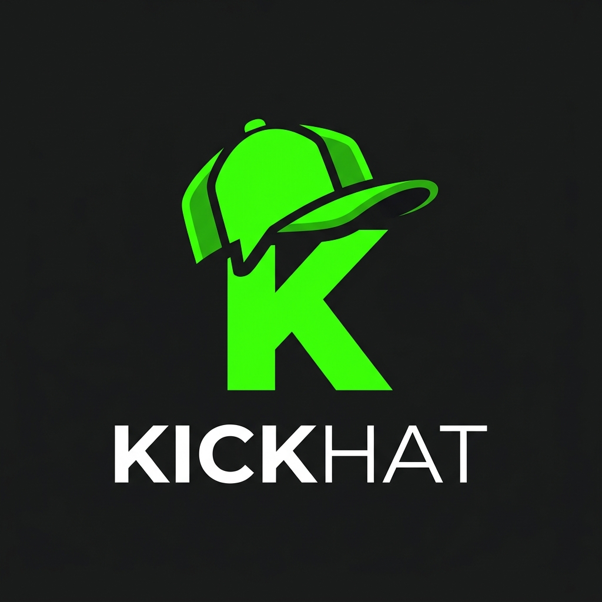

<p align="center">
  
</p>

<h1 align="center">KICKHAT</h1>

<p align="center">
  <strong>Kick.com yayıncıları ve moderatörleri için geliştirilmiş, en gelişmiş ve özelleştirilebilir masaüstü sohbet uygulaması.</strong>
</p>

<p align="center">
  <a href="#özellikler">Özellikler</a> •
  <a href="#kurulum">Kurulum</a> •
  <a href="#kullanım">Kullanım</a> •
  <a href="#katkıda-bulunma">Katkıda Bulunma</a>
</p>

---

## 🚀 Özellikler

KICKHAT, standart Kick sohbetini bir üst seviyeye taşımak için modern teknolojilerle (Tauri + React) baştan aşağı özel olarak tasarlanmıştır.

- **💬 Gelişmiş Mesaj Alıntılama:** Kullanıcıların mesajlarını birbirine bağlayan ve sohbet akışını kaybetmeden geçmiş mesajları küçük pencerelerde gösteren akıllı alıntılama sistemi.
- **🔄 Otomatik Güncelleme:** Uygulama, yeni bir sürüm çıktığında sizi rahatsız etmeden arka planda güncellemeleri kontrol eder ve tek tıkla otomatik olarak kendini yeniler.
- **🤖 Yapay Zeka Destekli Analiz:** Sohbetin genel durumunu, trendleri ve öne çıkan konuları analiz eden dahili AI (Ollama) entegrasyonu.
- **🎨 Göz Yormayan Şeffaf Temalar:** İster koyu modda, ister açık modda olun; yazıları daha net okuyabilmeniz için özel olarak ayarlanmış opak arka planlı, şeffaf sohbet kutucukları.
- **👑 Etkileşim İzleyici:** "Kicks" puanı ile alınan hediyeleri, abone olanları ve kanala destek sağlayan etkinlikleri anında yakalayarak ekrana düşürür.
- **⚡ Yüksek Performans:** Rust dili üzerine kurulu Tauri mimarisi sayesinde bilgisayarınızı yormaz, minimum RAM ve işlemci tüketimi ile maksimum akıcılık sağlar.

## 📥 Kurulum

KICKHAT uygulamasını kullanmaya başlamak çok basittir.

### Windows Kullanıcıları İçin
1. [Releases](../../releases/latest) (Sürümler) sayfasına gidin.
2. En son yayınlanan sürümün altındaki `KICKHAT_x.x.x_x64-setup.exe` veya `.msi` dosyasını indirin.
3. İndirdiğiniz dosyayı çalıştırın ve ekrandaki talimatları izleyerek kurulumu tamamlayın.
4. Masaüstünüze gelen KICKHAT kısayolu ile uygulamayı başlatın!

### Geliştiriciler İçin (Kaynak Kodundan Derleme)
Eğer uygulamayı kendiniz derlemek veya geliştirmek isterseniz:

**Gereksinimler:**
- [Node.js](https://nodejs.org/) (v20 veya üzeri)
- [Rust](https://www.rust-lang.org/) (Tauri derleyicisi için)

**Adımlar:**
```bash
# Depoyu bilgisayarınıza klonlayın
git clone https://github.com/Weltgeistt/KICKHAT.git

# Klasöre girin
cd KICKHAT

# Gerekli kütüphaneleri yükleyin
npm install

# Geliştirici modunda uygulamayı başlatın
npm run tauri dev

# VEYA direkt yayınlanabilir EXE oluşturmak için derleyin
npm run tauri build
```

## 🛠 Kullanım ve Ayarlar

- **Kanal Bağlama:** Uygulama açıldığında Kick kanal adınızı yazarak doğrudan o kanalın canlı sohbetine bağlanabilirsiniz.
- **Ayarlar Menüsü:** Sağ üst veya alt köşedeki ayarlar simgesine tıklayarak arayüz renklerini, otomatik güncelleme seçeneklerini ve analiz bildirimlerini kişiselleştirebilirsiniz.
- **Güncelleme Denetimi:** Menüden "Güncellemeleri Denetle" butonuna tıklayarak her zaman en yeni sürümde kaldığınızdan emin olabilirsiniz.

## 🤝 Katkıda Bulunma

KICKHAT sürekli gelişen bir projedir. Fikirlerinizi paylaşmak veya kod katkısında bulunmak isterseniz:
1. Bu depoyu "Fork"layın.
2. Kendi özellik dalınızı oluşturun (`git checkout -b ozellik/YeniHarikaOzellik`).
3. Yaptığınız değişiklikleri kaydedin (`git commit -m 'Harika bir özellik eklendi'`).
4. Dalınızı (branch) gönderin (`git push origin ozellik/YeniHarikaOzellik`).
5. Bir "Pull Request" (Çekme İsteği) açın.

---

<p align="center">
  <i>Geliştiriciler: <b><a href="https://github.com/ademiru">Ademiru</a></b> & <b><a href="https://github.com/Weltgeistt">Poyland</a></b></i>
</p>
